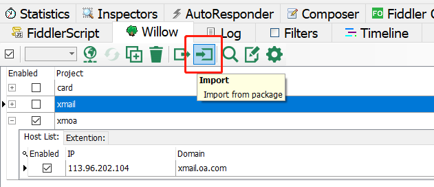

#xmoa
## 1.项目运行

* npm i 安装依赖
* 本地开发: npm run server  
监听localhost:8085
* 代理:  
(1).fiddler Willow配置,导入本项目中doc/tools/xmoa.wpkg即可
  
(2).nginx代理,解压tools中的nginx-xmail-oa,运行nginx即可
## 2.项目访问
* 以reading这个页面为例  
npm run server 启动服务以后  
要开启fiddler和nginx  
访问http://xmail.oa.com/templates/read-home.html/  
此时走的是本地环境
* 其中t='xxxx' 这个就是要访问的模板名,对应项目中src/page/reading-home/read-home.html  
注意是'xxxx'对应的是html名而不是包名
* 当项目部署到线上机后  
可以关掉fiddler访问http://xmail.oa.com/oa/call?func=4&t=read-home
此时走的是线上环境
## 3.项目结构
* build 和 config :项目构建的一些配置
* src/components-ui:可以独立出来的一些公用组件
* service:封装axios,用来调用cgi
* style:公用的一些样式和资源
## 4.开发新的页面
* 在src/page下新建包,每个包作为一个独立的应用
* 新建的包中应当包涵   
App.vue  
xxx-yyy.html  
xxx-yyy.js  
加上xxx前缀是防止模板名相同导致的覆盖  
* 应当建立components包,放置此项目的组件
* 如果需要router,vuex,以及其他静态资源,都应放置在本应用的包中
